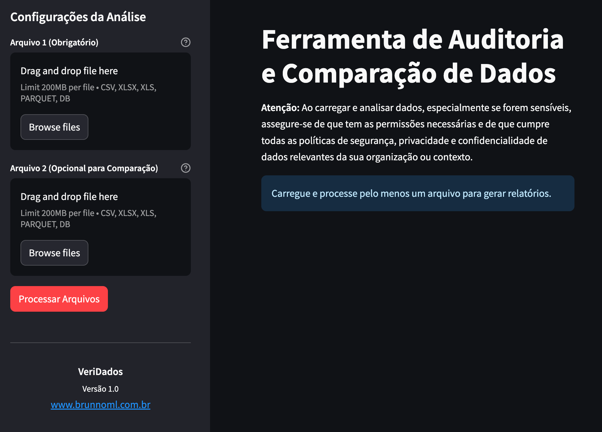

<h1 align="center"> VeriDados - Ferramenta de Auditoria e Comparação de Dados </h1>

<p align="center">
Projeto Streamlit para verificar, auditar e comparar conjuntos de dados de diversas fontes.
</p>

<p align="center">
  <a href="#-tecnologias">Tecnologias</a>&nbsp;&nbsp;&nbsp;|&nbsp;&nbsp;&nbsp;
  <a href="#-projeto">Projeto</a>&nbsp;&nbsp;&nbsp;|&nbsp;&nbsp;&nbsp;
  <a href="#-funcionalidades">Funcionalidades</a>&nbsp;&nbsp;&nbsp;|&nbsp;&nbsp;&nbsp;
  <a href="#-pré-requisitos">Pré-requisitos</a>&nbsp;&nbsp;&nbsp;|&nbsp;&nbsp;&nbsp;
  <a href="#-instalação">Instalação</a>&nbsp;&nbsp;&nbsp;|&nbsp;&nbsp;&nbsp;
  <a href="#memo-licença">Licença</a>
</p>

<p align="center">
  
</p>

<br>

<p align="center">
  
</p>

## 🚀 Tecnologias

Esse projeto foi desenvolvido com as seguintes tecnologias:

- Python (3.9+)
- Streamlit
- Pandas
- NumPy
- SQLAlchemy (para arquivos .db)
- Openpyxl (para arquivos .xlsx/.xls)
- PyArrow (para arquivos .parquet)
- Conda (para gerenciamento de ambiente)
- Git e Github
- VSCode (ou seu editor de preferência)

## 💻 Projeto

O `VeriDados` é uma aplicação web desenvolvida com Streamlit, projetada para facilitar a auditoria, análise exploratória e comparação de dados provenientes de diferentes formatos de arquivo. A ferramenta visa auxiliar na identificação de inconsistências, verificação da qualidade dos dados, comparação entre diferentes extrações ou versões de um conjunto de dados (por exemplo, antes e depois de um processo ETL), e na compreensão geral da estrutura e conteúdo dos dados.

Este projeto foi idealizado para ser uma ferramenta útil para analistas de dados, engenheiros de dados, e qualquer pessoa que precise realizar verificações rápidas e comparações detalhadas em seus conjuntos de dados, disponibilizando-a para a comunidade.

## 🎯 Funcionalidades

- **Carregamento de Dados Flexível:**
    - Suporte para arquivos CSV (com detecção automática de delimitador).
    - Suporte para arquivos Excel (.xlsx, .xls).
    - Suporte para arquivos Parquet (.parquet).
    - Suporte para bancos de dados SQLite (.db), com seleção de tabelas.
- **Análise Individual de Arquivos:**
    - **Visão Geral:** Número de linhas, colunas e amostra dos dados.
    - **Informações das Colunas:** Tipo de dado (Pandas), contagem de valores não nulos e valores únicos.
    - **Análise de Valores Distintos:** Visualização de valores únicos por coluna, com opção para tratar campos multivalor delimitados (ex: "valor1|valor2|valor3").
    - **Nulos e Vazios:** Identificação e quantificação de valores nulos e strings vazias (ou contendo apenas espaços) por coluna.
    - **Inconsistências de Capitalização:** Detecção de variações de capitalização para os mesmos valores textuais (ex: "Brasil", "brasil", "BRASIL").
    - **Formatos de Data Mistos:** Identificação (Beta) de colunas textuais que podem conter múltiplos formatos de data (ex: "DD/MM/YYYY" e "YYYY-MM-DD" na mesma coluna).
    - **Espaços Extras:** Detecção de valores textuais com espaços no início ou no fim.
    - **Estatísticas Descritivas:** Cálculo de média, mínimo, máximo, desvio padrão e contagem para colunas numéricas.
    - **Análise Detalhada de Campos Multivalor:** Para colunas com múltiplos valores separados por um delimitador customizável (ex: tags, categorias), exibe contagem total de itens, itens únicos, tabela de frequência e permite exportar esses resultados.
- **Comparação entre Dois Arquivos:**
    - **Comparação de Estrutura:** Verifica diferenças em nomes de colunas e tipos de dados, listando colunas exclusivas de cada arquivo.
    - **Contagem de Linhas e Colunas:** Apresenta um resumo das dimensões de cada arquivo e suas diferenças.
    - **Verificação de Chaves:**
        - Compara duas colunas-chave (uma de cada arquivo).
        - Mostra contagens e amostras de chaves únicas em cada arquivo, chaves comuns, chaves presentes no Arquivo 1 mas ausentes no Arquivo 2, e vice-versa.
        - Permite visualizar e exportar a lista completa de chaves para cada uma dessas categorias.
    - **Comparação de Valores:** Para as chaves correspondentes identificadas, compara os valores das colunas comuns restantes, indicando o número e percentual de divergências.
- **Exportação de Relatórios:**
    - Geração de relatórios consolidados da análise individual e da comparação em formato Excel (.xlsx).
    - Geração de relatórios consolidados em formato Markdown (.md).

## ⚙️ Pré-requisitos

Antes de começar, você precisará ter o [Python](https://www.python.org/downloads/) (versão 3.9 ou superior) instalado em sua máquina. O gerenciamento de pacotes Python (`pip`) também é necessário e geralmente vem com a instalação do Python.

Opcionalmente, se preferir usar `conda` para gerenciar ambientes:
- Baixe e instale [Miniconda](https://docs.conda.io/en/latest/miniconda.html) ou [Anaconda](https://www.anaconda.com/products/distribution).

## 🛠️ Instalação

Para usar a aplicação localmente, siga os passos abaixo:

1.  **Clone o repositório:**
    ```bash
    git clone https://github.com/brunnoml/VeriDados.git
    ```
    *(Substitua `brunnoml` pelo seu usuário do GitHub se você for criar o repositório lá primeiro)*

2.  **Acesse a pasta criada do projeto:**
    ```bash
    cd VeriDados
    ```

3.  **Crie e ative um ambiente virtual:**

    Recomenda-se o uso de um ambiente virtual para isolar as dependências do projeto.

    * **Usando `venv` (padrão do Python):**
        ```bash
        # Crie o ambiente virtual (Python 3.9+ recomendado)
        python -m venv .venv 
        ```
        ```bash
        # Ative o ambiente virtual
        # No Windows:
        .venv\Scripts\activate
        # No macOS/Linux:
        source .venv/bin/activate
        ```

    * **Usando `conda`:**
        ```bash
        # Crie o ambiente virtual conda com Python 3.9 (ou superior)
        conda create -n .audittc python=3.9 
        ```
        ```bash
        # Ative o ambiente virtual conda
        conda activate .audittc
        ```
        *(Você pode substituir `.venv` ou `.audittc` pelo nome que preferir para o ambiente)*

4.  **Instale as dependências:**

    Crie um arquivo chamado `requirements.txt` na raiz do projeto com o seguinte conteúdo:
    ```txt
    streamlit
    pandas
    numpy
    SQLAlchemy
    openpyxl
    pyarrow
    # Adicione outras dependências se surgirem
    ```
    Em seguida, instale as dependências:
    ```bash
    pip install -r requirements.txt
    ```

5.  **Execute a aplicação Streamlit:**
    Assumindo que o arquivo Python principal se chama `VeriDados.py` (ou o nome que você deu):
    ```bash
    streamlit run VeriDados.py
    ```
    A aplicação deverá abrir automaticamente no seu navegador web.

## 🪪 Licença

Esse projeto está sob a licença MIT.

---

Feito com :coffee: por [BrunnoML](https://www.brunnoml.com.br)